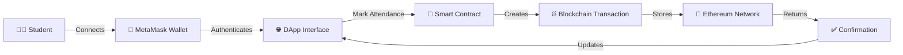

<div align="center">

# 🎓 Blockchain-Based Student Attendance & University Management System

### *Revolutionizing Education with Decentralized Technology*

[](https://reactjs.org/)
[](https://ethereum.org/)
[](https://soliditylang.org/)
[](https://metamask.io/)
[](https://hardhat.org/)

---

### 🌟 A **decentralized university management platform** with **blockchain-based attendance tracking** ensuring **transparency, security, and immutability**

</div>

---

## 📑 Table of Contents

- [📌 Project Overview](#-project-overview)
- [✨ Key Features](#-key-features)
- [🎯 Why Blockchain for Attendance?](#-why-blockchain-for-attendance)
- [🧱 Technology Stack](#-technology-stack)
- [📁 Project Architecture](#-project-architecture)
- [🔐 How It Works](#-how-it-works)
- [⚙️ Installation & Setup](#️-installation--setup)
- [🧪 Testing Guide](#-testing-guide)
- [📸 Screenshots](#-screenshots)
- [💡 Use Cases](#-use-cases)
- [🚀 Future Roadmap](#-future-roadmap)
- [🤝 Contributing](#-contributing)
- [👩‍💻 Developer](#-developer)
- [📜 License](#-license)

---

## 📌 Project Overview

> **Transforming traditional university management into a decentralized, transparent, and secure ecosystem**

This **full-stack decentralized application (DApp)** integrates blockchain technology with conventional university management systems. The platform manages:

- 📋 **Admissions & Registrations**
- 👨‍🎓 **Student Information Systems**
- 👩‍🏫 **Faculty Management**
- 📚 **Course & Library Management**
- 🚌 **Transport Services**
- ✅ **Blockchain-Powered Attendance** *(Core Innovation)*

The **attendance module** leverages **Ethereum blockchain** to create an **immutable, transparent, and tamper-proof** record-keeping system that eliminates fraud and ensures accountability.

---

## ✨ Key Features

<table>
<tr>
<td width="50%">

### 🔗 Blockchain Features
- ✅ **Immutable Attendance Records**
- ✅ **Smart Contract Automation**
- ✅ **MetaMask Wallet Integration**
- ✅ **Ethereum-Based Transactions**
- ✅ **Decentralized Data Storage**
- ✅ **Cryptographic Security**

</td>
<td width="50%">

### 🌐 Web Platform Features
- ✅ **Student Dashboard & Portal**
- ✅ **Faculty Management System**
- ✅ **Admission Portal**
- ✅ **Course Catalog**
- ✅ **Digital Library**
- ✅ **Transport Management**

</td>
</tr>
</table>

---

## 🎯 Why Blockchain for Attendance?

<div align="center">

| Traditional System ❌ | Blockchain Solution ✅ |
|----------------------|------------------------|
| Prone to manipulation | Tamper-proof records |
| Centralized database | Decentralized & distributed |
| No transparency | Complete transparency |
| Proxy attendance possible | Wallet-based verification |
| Data loss risks | Permanent storage |
| Manual verification | Automated smart contracts |

</div>

### 🔒 Security Advantages

```diff
+ Cryptographic hashing ensures data integrity
+ Distributed ledger prevents single point of failure
+ Smart contracts eliminate human intervention
+ MetaMask authentication prevents identity fraud
+ Timestamp verification ensures real-time tracking
```

---

## 🧱 Technology Stack

<div align="center">

### Frontend Technologies


### Blockchain & Smart Contracts


### Tools & Utilities


</div>

---

## 📁 Project Architecture

```bash
🎓 PROJECT-ROOT
│
├── 📜 artifacts/                     # Compiled smart contract artifacts
│   └── contracts/
│       └── Attendance.json
│
├── 💾 cache/                         # Hardhat compilation cache
│
├── 📝 contracts/                     # Solidity smart contracts
│   └── Attendance.sol                # Main attendance contract
│
├── 🌐 edu-ums/                       # React frontend application
│   │
│   ├── 📦 node_modules/              # Dependencies
│   │
│   ├── 🌍 public/                    # Static files
│   │   ├── index.html
│   │   ├── favicon.ico
│   │   └── pages/                    # Additional static pages
│   │
│   └── 💻 src/                       # Source code
│       │
│       ├── 🖼️ assets/                # Images, icons, media
│       │   ├── images/
│       │   ├── icons/
│       │   └── logos/
│       │
│       ├── ⛓️ blockchain/            # Blockchain integration layer
│       │   ├── config.js             # Contract addresses & network config
│       │   ├── contractABI.json      # Contract ABI
│       │   └── useBlockchain.js      # Custom React hooks
│       │
│       ├── 🧩 components/            # Reusable UI components
│       │   ├── Navbar.jsx            # Navigation bar
│       │   ├── Footer.jsx            # Footer component
│       │   ├── Sidebar.jsx           # Sidebar navigation
│       │   └── Card.jsx              # Card component
│       │
│       ├── 📄 pages/                 # Application pages/routes
│       │   ├── Home.jsx              # Landing page
│       │   ├── About.jsx             # About university
│       │   ├── AdmissionPortal.jsx   # Admission portal
│       │   ├── Attendance.jsx        # 🔗 Blockchain attendance
│       │   ├── StudentLogin.jsx      # Student authentication
│       │   ├── StudentDashboard.jsx  # Student panel
│       │   ├── Faculty.jsx           # Faculty management
│       │   ├── Courses.jsx           # Course catalog
│       │   ├── Library.jsx           # Digital library
│       │   ├── Transport.jsx         # Transport services
│       │   ├── Contact.jsx           # Contact page
│       │   ├── Register.jsx          # User registration
│       │   └── Registration.jsx      # Course registration
│       │
│       ├── 🎨 styles/                # CSS stylesheets
│       │   ├── App.css
│       │   ├── index.css
│       │   └── components/
│       │
│       ├── 🚀 App.jsx                # Main app component
│       └── 🎯 main.jsx               # Entry point
│
├── 📜 hardhat.config.js              # Hardhat configuration
├── 📦 package.json                   # Project dependencies
└── 📖 README.md                      # Project documentation
```

---

## 🔐 How It Works

### 🔄 Blockchain Attendance Flow



### 📋 Step-by-Step Process

1. **🔌 Wallet Connection**
   - Student connects MetaMask wallet to the platform
   - Wallet address serves as unique identity
   - No passwords or manual authentication required

2. **✍️ Attendance Marking**
   - Faculty initiates attendance session via smart contract
   - Students click "Mark Present" during the session window
   - Transaction is signed with student's private key

3. **⛓️ Blockchain Recording**
   - Attendance data (student ID, timestamp, course) sent to smart contract
   - Smart contract validates and records on Ethereum blockchain
   - Gas fees paid from connected wallet

4. **✅ Verification**
   - Transaction hash generated as proof
   - Record becomes immutable and publicly verifiable
   - Data queryable from blockchain explorer

5. **📊 Data Retrieval**
   - Faculty can query attendance records from smart contract
   - Reports generated from on-chain data
   - Analytics dashboard displays attendance trends

---


### 🔍 Manual Testing Steps

1. **Connect Wallet**
   - Open application in browser
   - Click "Connect Wallet"
   - Approve MetaMask connection

2. **Mark Attendance**
   - Navigate to Attendance page
   - Click "Mark Present"
   - Confirm transaction in MetaMask
   - Wait for confirmation

3. **Verify on Blockchain**
   - Copy transaction hash
   - Check on Etherscan (or local explorer)
   - Verify attendance data

4. **Query Records**
   - View attendance history
   - Filter by date/course
   - Export reports

---
## 💡 Use Cases

### 🎓 Educational Institutions

- **Universities & Colleges**
  - Track student attendance across departments
  - Generate tamper-proof attendance certificates
  - Audit compliance with attendance regulations

- **Online Learning Platforms**
  - Verify participation in virtual classes
  - Reward consistent attendance with tokens
  - Create transparent learning records

### 🏢 Corporate Training

- **Employee Training Programs**
  - Track mandatory training completion
  - Verify certifications with blockchain
  - Maintain permanent training records

### 🔬 Research & Development

- **Academic Research**
  - Study blockchain adoption in education
  - Analyze attendance patterns
  - Test decentralized identity systems

---

## 🚀 Future Roadmap

### Phase 1: Core Enhancements ✅
- [x] Basic attendance marking
- [x] MetaMask integration
- [x] Smart contract deployment
- [ ] Role-based access control (Admin/Faculty/Student)
- [ ] Multi-signature approvals for critical operations

### Phase 2: Advanced Features 🔄
- [ ] **IPFS Integration** - Store documents and certificates
- [ ] **QR Code Attendance** - Scan to mark attendance
- [ ] **Biometric Verification** - Face recognition integration
- [ ] **NFT Certificates** - Issue blockchain-based certificates
- [ ] **Analytics Dashboard** - AI-powered insights

### Phase 3: Scalability 📈
- [ ] **Layer 2 Solutions** - Polygon/Arbitrum for lower gas fees
- [ ] **Multi-university Support** - Network of institutions
- [ ] **Mobile Application** - iOS & Android apps
- [ ] **Progressive Web App** - Offline capability
- [ ] **API Development** - Third-party integrations

### Phase 4: Innovation 🌟
- [ ] **DAO Governance** - Community-driven decision making
- [ ] **Token Economy** - Reward system for attendance
- [ ] **AI Integration** - Predictive analytics for student performance
- [ ] **VR/AR Classrooms** - Metaverse attendance tracking
- [ ] **Cross-chain Support** - Multi-blockchain compatibility

--

## 🙏 Acknowledgments

- **Ethereum Foundation** - For blockchain infrastructure
- **OpenZeppelin** - For secure smart contract libraries
- **MetaMask** - For wallet integration
- **Hardhat** - For development environment
- **React Team** - For the amazing frontend framework
<div align="center">

</div>
